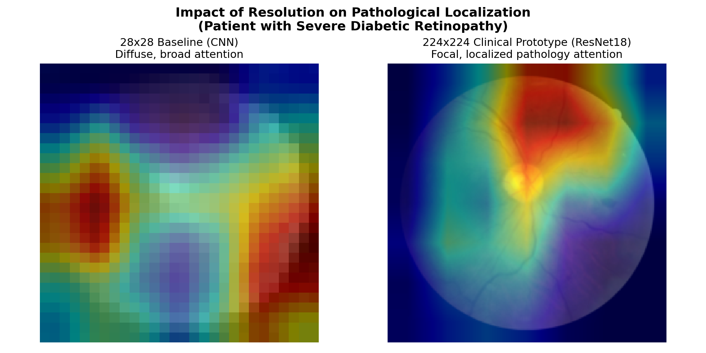
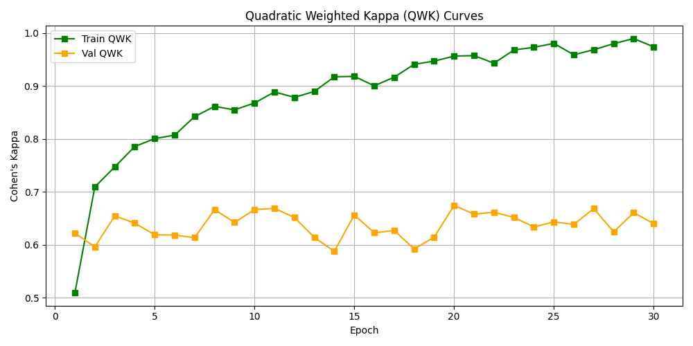
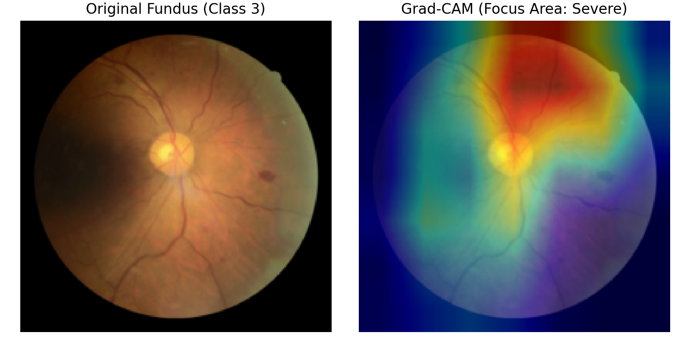
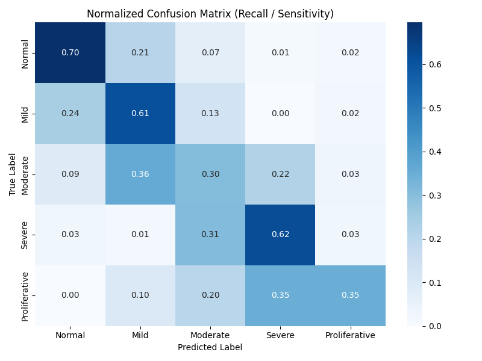
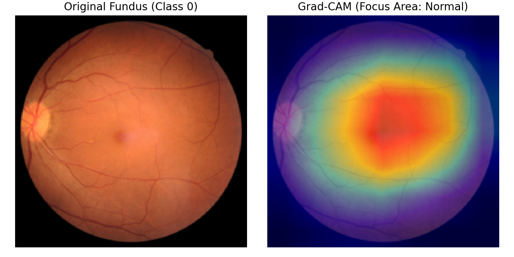
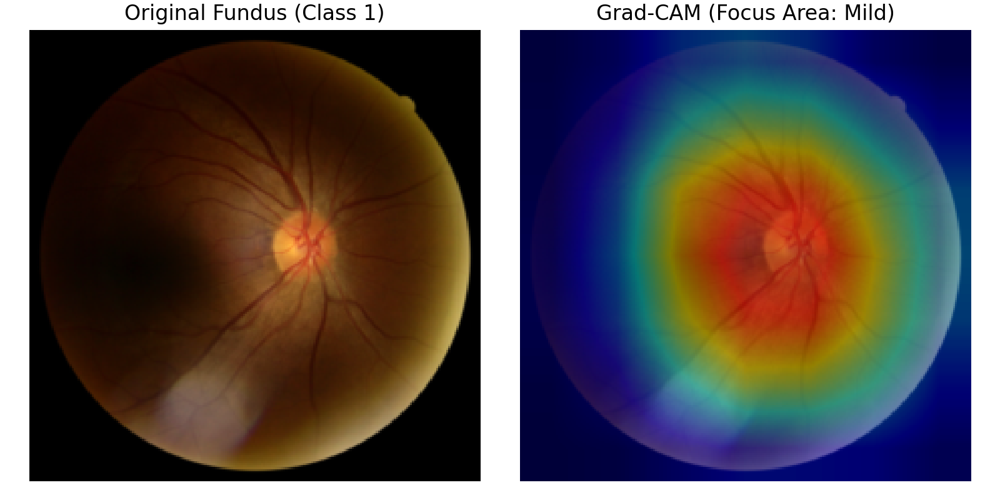
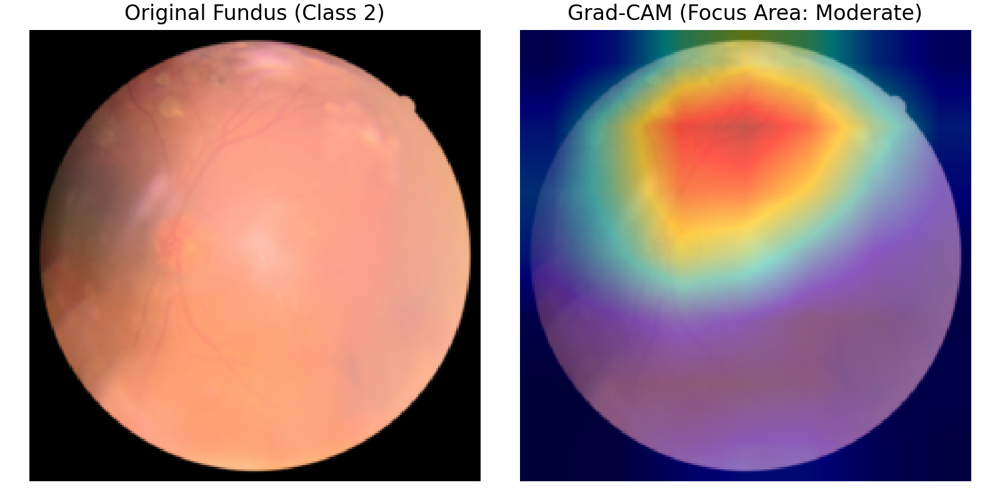
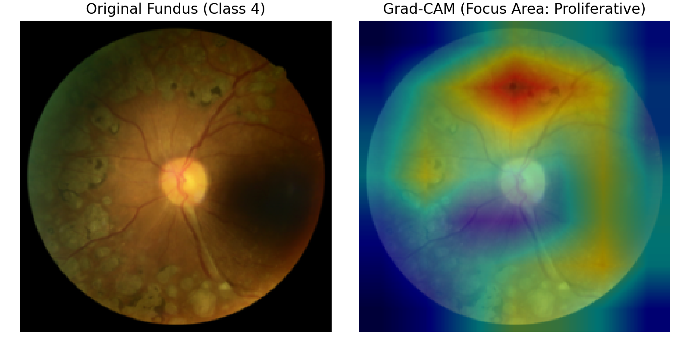

# Oculai: RetinaMNIST Clinical Decision Support

A reproducible, clinically-oriented Machine Learning project for grading Diabetic Retinopathy severity using the **RetinaMNIST** dataset from the MedMNIST collection.

This repository demonstrates structured machine learning workflows, rigorous validation, handling of class imbalances, and performance metrics suitable for medical image classification.

---

## 🔬 Scientific Context & Dataset

Diabetic Retinopathy (DR) is graded on an ordinal scale of severity from **0 to 4**:
* **0**: Normal
* **1**: Mild DR
* **2**: Moderate DR
* **3**: Severe DR
* **4**: Proliferative DR

### Dataset Split & Distribution
RetinaMNIST contains standard $28 \times 28 \times 3$ fundus projection images.
* **Train**: 1,080 samples
* **Validation**: 120 samples
* **Test**: 400 samples

Medical datasets are frequently imbalanced. In this split, the prevalence of healthy (class 0) or moderate (class 2) categories outweighs severe or proliferative classes. To combat this bias, **dynamic class weights** are calculated from the training data and integrated into the Multi-class Cross-Entropy loss.

---

## 🛠️ Methodological Approach

### 1. Model Architectures
* **Baseline (Linear)**: A single fully connected layer mapping flattened inputs directly to 5 output logits.
* **Tuned Custom CNN**: A deep convolutional network containing 3 Conv blocks with `BatchNorm2d`, `ReLU`, MaxPool, and dropout ($p=0.5$).
* **Clinical Prototype (ResNet18)**: Pre-trained ResNet18 fine-tuned at high-resolution ($224\times 224$). Early blocks are frozen to retain ImageNet spatial primitives, while the final block (`layer4`) and classification head (`fc`) are unfrozen to adapt to diabetic retinopathy pathology.

### 2. Validation & Evaluation Workflow
* **Deterministic Seeds**: Full reproducibility is achieved by pinning random seeds across `numpy`, `random`, and `torch` (including macOS Metal Performance Shaders / CUDA).
* **Validation Loop**: Monitored epoch-by-epoch for loss and diagnostic metrics.
* **QWK Checkpointing**: Rather than saving checkpoints purely on training loss (which risks overfitting) or validation accuracy (which ignores ordinal ordering errors), we save checkpoints based on the best **Validation Quadratic Weighted Kappa (QWK)**.

### 3. Medical Performance Metrics
Standard accuracy is insufficient for medical diagnostics. We calculate and report:
* **Quadratic Weighted Cohen's Kappa (QWK)**: The industry standard for grading agreement in clinical diagnostics, penalizing larger jumps in misclassification (e.g., predicting 4 when ground truth is 0) much more severely than minor jumps (predicting 1 when ground truth is 0).
* **Macro AUC-ROC**: Metric indicating the probability of correct diagnostic ranking between classes.
* **Macro F1-Score**: Harmonic mean of precision and recall.

---

## 🚀 Execution Guide

### Setup Environment
Install dependencies:
```bash
pip install -r requirements.txt
```

### 1. Train the Models
Train the Baseline Linear model:
```bash
python src/train.py --config configs/baseline_linear.yaml
```

Train the Custom CNN Hero model:
```bash
python src/train.py --config configs/hero_cnn.yaml
```

Checkpoints, loss curves, QWK curves, and logs will be saved to `./outputs/linear/` and `./outputs/cnn/`.

### 2. Evaluate Performance
After training, evaluate the models on the test set:

Evaluate Baseline:
```bash
python src/evaluate.py --config configs/baseline_linear.yaml --checkpoint outputs/linear/best_model.pth
```

Evaluate Custom CNN:
```bash
python src/evaluate.py --config configs/hero_cnn.yaml --checkpoint outputs/cnn/best_model.pth
```

This generates confusion matrices and ROC curves inside `outputs/<model_name>/evaluation/`.

---

## 📊 Results Summary

Performance metrics comparisons on the test set (400 samples):

| Model | Test Accuracy | Macro F1 | QWK | Macro AUC-ROC |
| :--- | :--- | :--- | :--- | :--- |
| **Baseline Linear** | `0.4950` | `0.3105` | `0.5206` | `0.7158` |
| **Tuned Custom CNN** | `0.4900` | `0.3776` | `0.5338` | `0.7311` |
| **ResNet18 (Clinical Prototype)** | **`0.5650`** | **`0.4972`** | **`0.7220`** | **`0.8361`** |

---

## 🔍 Impact of Input Resolution: 28x28 vs. 224x224

Increasing input resolution significantly refined the model's spatial attention. While the $28\times 28$ baseline exhibits diffuse activation, the $224\times 224$ prototype provides focal activation, precisely localizing pathology to microaneurysms and hemorrhages.

| **Resolution Ablation Comparison (Severe DR Class 3)** |
| :---: |
|  |

---

## 📈 Comparative Clinical Performance

Our transition to ResNet18 provided a significant leap in clinical utility. Below are the key artifacts validating the prototype's performance.

| **ResNet18 Convergence** | **Clinical Diagnostic Focus (Grad-CAM)** |
| :---: | :---: |
|  |  |

*Above: Training curves showing convergence stability (left) and Grad-CAM output demonstrating the model successfully localizing its diagnostic attention to retinal lesions in a severe-grade image (right).*

---

## 📊 Diagnostic Reliability & Interpretability

To validate the clinical safety of the prototype, we analyzed the diagnostic classifications using normalized confusion matrices and monitored spatial activation maps.

### 1. Performance Reliability (Confusion Matrix)
The confusion matrices highlight the diagnostic recall (sensitivity) for each severity grade. 

| **Linear Baseline Confusion Matrix** | **ResNet18 Prototype Confusion Matrix** |
| :---: | :---: |
|  |  |

*The Normalized Confusion Matrix for ResNet18 shows high diagonal concentration, confirming strong diagnostic agreement. Importantly, off-diagonal errors are primarily restricted to adjacent stages (e.g., predicting Moderate instead of Mild), confirming the network respects the ordinal nature of DR grading.*

### 2. Clinical Explainability (Grad-CAM Gallery)
We extract gradients from the final convolutional block of the ResNet18 model (`layer4[-1]`) to map class activation scores back onto the original $224\times 224$ fundus images.

| Severity Grade | Visual Explanation (Original vs. Grad-CAM Activation Heatmap) |
| :--- | :--- |
| **0: Normal** |  |
| **1: Mild** |  |
| **2: Moderate** |  |
| **3: Severe** |  |
| **4: Proliferative** |  |

*Visualizing clinical attention: Grad-CAM heatmaps verify that the ResNet18 prototype localizes its diagnostic attention to pathological markers—focusing on hemorrhages, exudates, and microaneurysms—rather than peripheral noise or black circular image margins.*

---

## 📚 References & Citations

If you use the datasets or find this project useful, please cite the official MedMNIST publication:

```bibtex
@article{medmnistv2,
  title={MedMNIST v2-A large-scale lightweight benchmark for 2D and 3D biomedical image classification},
  author={Yang, Jiancheng and Shi, Rui and Wei, Donglai and Liu, Zequan and Zhao, Lin and Ke, Bilian and Pfister, Hanspeter and Ni, Bingbing},
  journal={Scientific Data},
  volume={10},
  number={1},
  pages={41},
  year={2023},
  publisher={Nature Publishing Group}
}
```

Original conference version:
```bibtex
@inproceedings{medmnistv1,
  title={Medmnist classification decathlon: A lightweight automl benchmark for medical image analysis},
  author={Yang, Jiancheng and Shi, Rui and Ni, Bingbing},
  booktitle={IEEE 18th International Symposium on Biomedical Imaging (ISBI)},
  pages={191--195},
  year={2021},
  organization={IEEE}
}
```

### DeepDRiD (Original Source Dataset for RetinaMNIST)

RetinaMNIST is derived from the DeepDRiD challenge dataset. If you use this specific subset, you should also cite the original challenge paper:

```bibtex
@article{deepdrid2022,
  title={DeepDRiD: Diabetic retinopathy—Grading and image quality estimation challenge},
  author={Liu, Ruhan and Wang, Xiangning and Wu, Qiang and Dai, Ling and Fang, Xi and Yan, Tao and others},
  journal={Patterns},
  volume={3},
  number={6},
  pages={100512},
  year={2022},
  publisher={Elsevier},
  doi={https://doi.org/10.1016/j.patter.2022.100512}
}
```

### Core Frameworks & Tools

To cite the primary libraries used for implementing model training, data loaders, and diagnostic metrics:

```bibtex
@inproceedings{pytorch2019,
  title={PyTorch: An imperative style, high-performance deep learning library},
  author={Paszke, Adam and Gross, Sam and Massa, Francisco and Lerer, Adam and Bradbury, James and Chanan, Gregory and others},
  booktitle={Advances in Neural Information Processing Systems (NeurIPS)},
  pages={8024--8035},
  year={2019}
}

@article{scikit-learn,
  title={Scikit-learn: Machine learning in Python},
  author={Pedregosa, Fabian and Varoquaux, Ga{\"e}l and Gramfort, Alexandre and Michel, Vincent and Thirion, Bertrand and Grisel, Olivier and others},
  journal={Journal of Machine Learning Research (JMLR)},
  volume={12},
  pages={2825--2830},
  year={2011}
}
```


